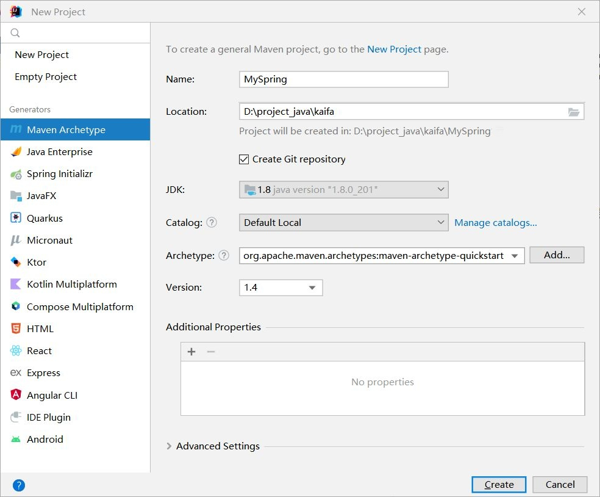
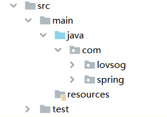

# 1. Spring 开发准备

创建一个maven项目



在java目录下分别创建 **com.spring包** 和 **com.lovsog包**

- **com.spring包**: 用来存放开发好的Spring代码
- **com.lovsog包**: 用来存放对Spring应用的Demo



紧接着，在 com.spring包 下创建容器类 `MyApplicationContext.java` 

```java
package com.spring;

public class MyApplicationContext {
    private Class configClass;

    public MyApplicationContext(Class configClass) {
        this.configClass = configClass;
        // 做其他操作...
    }

    public Object getBean(String beanName) {
        return null;
    }
}
```

之后，在 com.lovsog包 下创建 `Text.java`，相当于启动类

```java
package com.lovsog;

import com.spring.MyApplicationContext;

public class Text {
    public static void main(String[] args) {
        // 创建容器
        MyApplicationContext applicationContext = new MyApplicationContext(AppConfig.class);
    }
}
```

最后，在 com.lovsog包 下创建 配置类 `AppConfig.java`

```java
package com.lovsog;

import com.spring.ComponentScan;

public class AppConfig {
}
```

